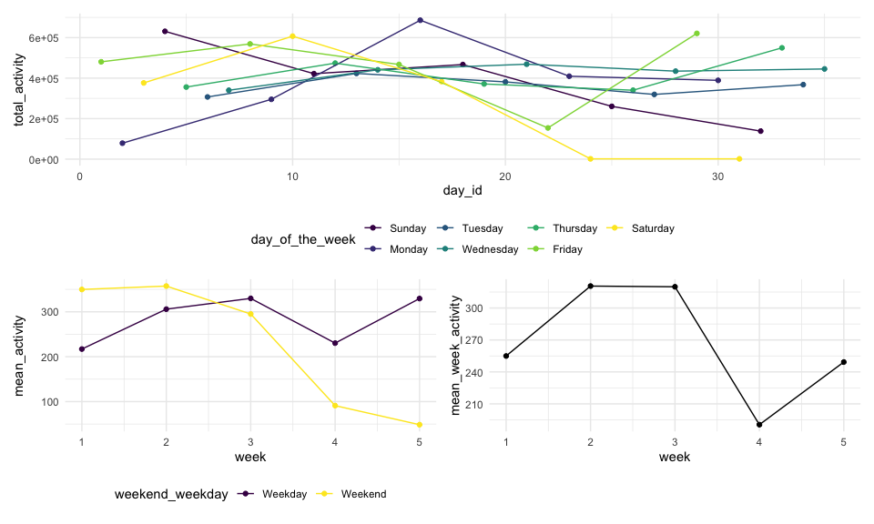
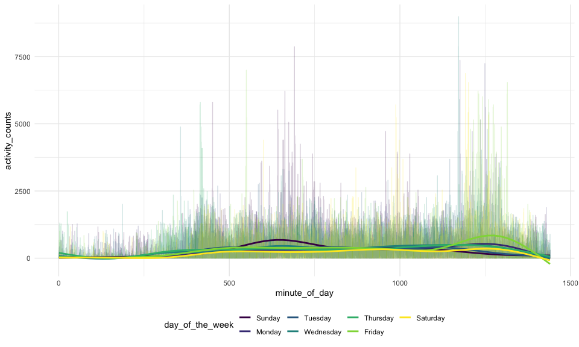

HW3
================
Chen Mo
10/7/2020

Load the library

``` r
library(tidyverse)
```

    ## ── Attaching packages ──────────────────────────────────────────────────────────── tidyverse 1.3.0 ──

    ## ✓ ggplot2 3.3.2     ✓ purrr   0.3.4
    ## ✓ tibble  3.0.3     ✓ dplyr   1.0.2
    ## ✓ tidyr   1.1.2     ✓ stringr 1.4.0
    ## ✓ readr   1.3.1     ✓ forcats 0.5.0

    ## ── Conflicts ─────────────────────────────────────────────────────────────── tidyverse_conflicts() ──
    ## x dplyr::filter() masks stats::filter()
    ## x dplyr::lag()    masks stats::lag()

``` r
library(patchwork)
library(p8105.datasets)
```

Define the setup:

``` r
knitr::opts_chunk$set(
    fig.width = 10, 
  fig.asp = .6,
  out.width = "90%"
)
theme_set(theme_minimal() + theme(legend.position = "bottom"))
options(
  ggplot2.continuous.colour = "viridis",
  ggplot2.continuous.fill = "viridis"
)
scale_colour_discrete = scale_colour_viridis_d
scale_fill_discrete = scale_fill_viridis_d
```

\#Problem 1  
Load the data:

``` r
data("instacart")
```

This dataset contains 1384617 rows and 15 columns.

Observations are the level of items in orders by user. There are user /
order variables – user ID, order ID, order day, and order hour. There
are also item variables – name, aisle, department, and some numeric
codes.

\#\#\#question 1: how many aisles & which aisles are the most items
ordered from?

``` r
aisle_df =
instacart  %>% 
        count(aisle) %>% 
        arrange(desc(n))
```

There are 134 aisles and fresh vegetables is the most item ordered from.

\#\#\#question 2: make a plot that shows the number of items ordered in
each aisle.

``` r
instacart %>% 
        count(aisle) %>% 
        filter(n > 10000) %>% 
        mutate(
                aisle = factor(aisle),
                aisle = fct_reorder(aisle, n)
        ) %>% 
        ggplot(aes(x = aisle, y = n)) +
        geom_point() +
        theme(axis.text.x = element_text(angle = 90, vjust = 0.5, hjust = 1))
```


\#\#\#question 3: make a table showing the three most popular items in
each of the aisles:

``` r
instacart %>% 
    filter(aisle %in% c("baking ingredients", "dog food care", "packaged vegetables fruits")) %>% 
        group_by(aisle) %>% 
        count(product_name) %>% 
        mutate(rank = min_rank(desc(n))) %>%
        filter(rank < 4) %>%
        arrange(aisle,rank) %>% 
        knitr::kable()
```

| aisle                      | product\_name                                 |    n | rank |
| :------------------------- | :-------------------------------------------- | ---: | ---: |
| baking ingredients         | Light Brown Sugar                             |  499 |    1 |
| baking ingredients         | Pure Baking Soda                              |  387 |    2 |
| baking ingredients         | Cane Sugar                                    |  336 |    3 |
| dog food care              | Snack Sticks Chicken & Rice Recipe Dog Treats |   30 |    1 |
| dog food care              | Organix Chicken & Brown Rice Recipe           |   28 |    2 |
| dog food care              | Small Dog Biscuits                            |   26 |    3 |
| packaged vegetables fruits | Organic Baby Spinach                          | 9784 |    1 |
| packaged vegetables fruits | Organic Raspberries                           | 5546 |    2 |
| packaged vegetables fruits | Organic Blueberries                           | 4966 |    3 |

\#\#\#question 4: make a table showing the mean hour of the day:

``` r
instacart %>% 
        filter(product_name %in% c("Pink Lady Apples", "Coffee Ice Cream")) %>%
        group_by(product_name, order_dow) %>% 
        summarise(mean_hour_of_day = mean(order_hour_of_day)) %>% 
        pivot_wider(
                names_from = order_dow,
                values_from = mean_hour_of_day
                    ) %>%
        rename("Sunday" = "0", 
               "Monday" = "1", 
               "Tuesday" = "2", 
               "Wednesday" = "3", 
               "Thurday" = "4", 
               "Friday" = "5", 
               "Saturday" = "6") %>% 
        knitr::kable()
```

    ## `summarise()` regrouping output by 'product_name' (override with `.groups` argument)

| product\_name    |   Sunday |   Monday |  Tuesday | Wednesday |  Thurday |   Friday | Saturday |
| :--------------- | -------: | -------: | -------: | --------: | -------: | -------: | -------: |
| Coffee Ice Cream | 13.77419 | 14.31579 | 15.38095 |  15.31818 | 15.21739 | 12.26316 | 13.83333 |
| Pink Lady Apples | 13.44118 | 11.36000 | 11.70213 |  14.25000 | 11.55172 | 12.78431 | 11.93750 |

\#Problem 2

\#\#\#Question 1: load, tidy, and wrangle the data:

Load and clean the data:

``` r
accel_df = read_csv("./data/accel_data.csv") %>%
        janitor::clean_names() %>% 
        pivot_longer(
                activity_1:activity_1440,
                names_to = "minute_of_the_day",
                values_to = "activity_counts"
        ) %>% 
        separate(minute_of_the_day, into = c("activity", "minute_of_day"), sep = 9) %>% 
        mutate(
                minute_of_day = as.numeric(minute_of_day)) %>% 
        mutate(
                weekend_weekday = recode(day, "Friday" = "Weekday", "Monday" = "Weekday", "Tuesday" = "Weekday", "Wednesday" = "Weekday", "Thursday" = "Weekday", "Saturday" = "Weekend", "Sunday" = "Weekend")
        ) %>% 
        mutate(
                day_of_the_week = day
        ) %>% 
        mutate(
                no_of_day = recode(day_of_the_week, 
                        "Monday" = "1", 
                        "Tuesday" = "2", 
                        "Wednesday" = "3", 
                        "Thursday" = "4", 
                        "Friday" = "5", 
                        "Saturday" = "6", 
                        "Sunday" = "7")
                ) %>% 
        mutate(
                no_of_day = as.numeric(no_of_day),
                day_of_the_week = as_factor(day_of_the_week),
                day_of_the_week = fct_reorder(day_of_the_week, no_of_day)
        ) %>% 
        group_by(week) %>% 
        arrange(day_of_the_week, desc(no_of_day), .by_group = TRUE) %>% 
        select(-activity, -day, -no_of_day) %>%
        relocate(week, day_of_the_week, weekend_weekday) 
```

    ## Parsed with column specification:
    ## cols(
    ##   .default = col_double(),
    ##   day = col_character()
    ## )

    ## See spec(...) for full column specifications.

This dataset shows the information about time which includes number of
week, number of day, day of the week, weekend or weekday, and minute of
the day. The activity counts on each minute is also a key variable in
this dataset. There are 50400 observations in this dataset. And there
are 50400 rows and 6 columns in this dataset.

\#\#\#Question 2: create a table showing the total activity for each
day:

Create a table:

``` r
accel_df %>% 
         group_by(week, day_of_the_week) %>% 
         summarise(sum_activity = sum(activity_counts)) %>% 
         knitr::kable()
```

    ## `summarise()` regrouping output by 'week' (override with `.groups` argument)

| week | day\_of\_the\_week | sum\_activity |
| ---: | :----------------- | ------------: |
|    1 | Monday             |      78828.07 |
|    1 | Tuesday            |     307094.24 |
|    1 | Wednesday          |     340115.01 |
|    1 | Thursday           |     355923.64 |
|    1 | Friday             |     480542.62 |
|    1 | Saturday           |     376254.00 |
|    1 | Sunday             |     631105.00 |
|    2 | Monday             |     295431.00 |
|    2 | Tuesday            |     423245.00 |
|    2 | Wednesday          |     440962.00 |
|    2 | Thursday           |     474048.00 |
|    2 | Friday             |     568839.00 |
|    2 | Saturday           |     607175.00 |
|    2 | Sunday             |     422018.00 |
|    3 | Monday             |     685910.00 |
|    3 | Tuesday            |     381507.00 |
|    3 | Wednesday          |     468869.00 |
|    3 | Thursday           |     371230.00 |
|    3 | Friday             |     467420.00 |
|    3 | Saturday           |     382928.00 |
|    3 | Sunday             |     467052.00 |
|    4 | Monday             |     409450.00 |
|    4 | Tuesday            |     319568.00 |
|    4 | Wednesday          |     434460.00 |
|    4 | Thursday           |     340291.00 |
|    4 | Friday             |     154049.00 |
|    4 | Saturday           |       1440.00 |
|    4 | Sunday             |     260617.00 |
|    5 | Monday             |     389080.00 |
|    5 | Tuesday            |     367824.00 |
|    5 | Wednesday          |     445366.00 |
|    5 | Thursday           |     549658.00 |
|    5 | Friday             |     620860.00 |
|    5 | Saturday           |       1440.00 |
|    5 | Sunday             |     138421.00 |

Create plots showing the trend:

``` r
day_id_plot =
        accel_df %>% 
        group_by(week, day_id, day_of_the_week) %>% 
        summarise(total_activity = sum(activity_counts)) %>% 
        ggplot(aes(x = day_id, y = total_activity, color = day_of_the_week)) +
        geom_point() +
        geom_line()
```

    ## `summarise()` regrouping output by 'week', 'day_id' (override with `.groups` argument)

``` r
weekday_weekend_plot = 
        accel_df %>% 
        group_by(week, weekend_weekday) %>% 
        summarise(mean_activity = mean(activity_counts)) %>% 
        ggplot(aes(x = week, y = mean_activity, color = weekend_weekday)) +
        geom_point() +
        geom_line()
```

    ## `summarise()` regrouping output by 'week' (override with `.groups` argument)

``` r
week_plot = 
        accel_df %>% 
        group_by(week) %>% 
        summarise(mean_week_activity = mean(activity_counts)) %>% 
        ggplot(aes(x = week, y = mean_week_activity)) +
        geom_point() +
        geom_line()
```

    ## `summarise()` ungrouping output (override with `.groups` argument)

``` r
day_id_plot/(weekday_weekend_plot + week_plot)
```



From the week\_plot, we can find that this 63 year-old male has more
acitvities for the second week and the third week than for the forth
week and the fifth week since the mean of the activity counts shows the
trend.  
For the weekend\_weekday plot, we can see that during the weekdays, he
has regular activities. However, during the weekend, his activities
decreased a lot during five weeks since the mean of activity counts
during the weekend decreased a lot.  
For the day\_id\_plot, we can see that he has moderate and regular
activities on Tuesday, Wednesday, and Thursday. However, the amount of
activity counts fluctuated a lot on Monday, Friday, and Saturday.

\#\#\#Question 3 :

Create a plot:

``` r
accel_df %>%
        ggplot(aes(x = minute_of_day, y = activity_counts, color = day_of_the_week)) +
        geom_line(alpha = 0.2) +
        stat_smooth(se = FALSE)
```

    ## `geom_smooth()` using method = 'gam' and formula 'y ~ s(x, bs = "cs")'


Zoom in the plot above:

``` r
accel_df %>% 
        ggplot(aes(x = minute_of_day, y = activity_counts, color = day_of_the_week)) +
        geom_line(alpha = 0.2) + 
        stat_smooth(se = FALSE) + 
        coord_cartesian(ylim = c(0, 2500))
```

    ## `geom_smooth()` using method = 'gam' and formula 'y ~ s(x, bs = "cs")'


The plot after zooming in shows the activity counts in each minute
during 5 weeks and the information of the mean of activity counts for
each day of the week. We can see that the acitivity counts of this 63
year-old male fluctuated a lot during a day. From 0 to 300 minutes(which
equals 0:00 to 5:00), the activity counts are relatively low. After 300
minute(which equals to 5:00), the activity counts increased a lot.
Around 1300 minutes(which equals to 21:40), the activity counts start to
decrease. Until 1440 minutes(which equals to 24:00), the activity counts
decreased to zero.  
And we can see that on Sunday, from 500 minutes to 750 minutes(which
equals 8:20 to 12:30), he have more activity counts compared to the
activity counts during the same period on other days. From 1100 minutes
to 1400 minutes(which equals 18:20 to 23:20) on Friday, he have more
activity counts compared to the activity counts during the same period
on other days.

\#Problem 3 Load the data:

``` r
library(p8105.datasets)
data("ny_noaa")
```
